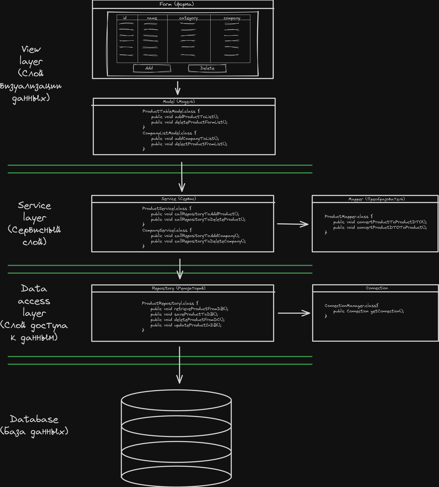

# Архитектура

# Установка
1. Выполните sql-файл с названием **product_and_companies_example.sql** в вашей БД. Этот файл вы можете найти в корневом каталоге  проекта. Мы собираемся подключиться к этой базе данных.
2. Подключить модуль драйвера PostgeSQL к проекту.
3. Настройте **variables.properties**. Там такие переменные, как адрес, логин и пароль вашей базы данных.
4. Заполните таблицы какими либо данными в следующей поседовательности countries, companies, categories, products.